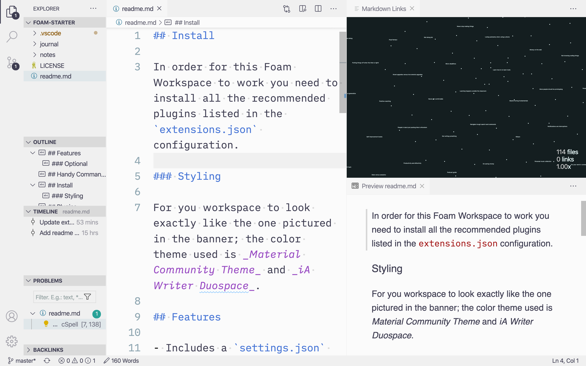

<em>A (roam research inspired) note taking system.</em>

<a href="#description">Description</a> |
<a href="#install">Install</a> |
<a href="#features">Features</a> |
<a href="#support">Support</a>

## Description

This note-taking system uses Foam, a personal knowledge management and sharing system inspired by Roam Research, built on Visual Studio Code (with extensions).

You don't need another new application to write notes. Just use the code editor you already use. Tons of customizability and an interface you are already familiar with.

For me this is not a replacement of Notion. Foam is more for research and writing. Not planning, tasks and todo's.

> This is more of a technical set-up then an in-depth guide on how this note-taking system works. Refer to the [`philosophy.md`](./docs/philosophy.md) for more information about some principles behind this starter. Have a look at the [`resources.md`](./docs/resources.md) for further reading.

## Install

In order for this Foam Workspace to work you need to install all the recommended plugins listed in the `extensions.json` configuration.

### Styling

For you workspace to look exactly like the one pictured in the banner; the color theme used is _Material Community Theme_ and _iA Writer Duospace_.

## Features

- Includes a `settings.json` with writing optimized settings and removes most 'clutter' from the VS Code interface
- Includes a `extensions.json` to quickly download all the necessary extensions required for this Foam workspace
- Includes `.code-snippets` for note templates etc.

### Note-taking

- Graph view to show connections
- Multiplexer (pane view) to show the same note in different formats
- Syncing by pushing to GitHub
- Outline view of the headings
- Preview mode (markdown rendering)
- Spell, grammar checker
- Bi-directional linking
- Complex Search (VS Code has a ton of narrowing options)
- Misc. things like word counting, line and character counts etc.

### Optional

- Publish using [GitHub pages][pages] or [11ty and Netlify][11ty].
- Version control using Git (and GitHub) with a history timeline using GitLens.
- Draw.io integration to create diagrams inside VS Code.

## Handy Commands

All of these are accessible from the command pallete (cmd + p):

- `Toggle zen mode (⌘K + Z)` to focus completely on writing and hide all other panels.
- `Foam: Open Daily Note` to start a daily note for your journal.
- `Create table of contents` to turn headings into a TOC.

Foam commands, syntax and shortcuts:

- #tags
- [[Internal links]]

## Support

I believe in making resources and products public and free (as in freedom, not free as in free frappuccinos) so people can build upon them. If you like my resources and products you can consider [supporting me][support].

Made with 🤍 by [Danny de Vries][author] and [contributors][contributors].

## License

[MIT][license] © [Danny de Vries][author]

[11ty]: https://foambubble.github.io/foam/eleventy-and-netlify
[pages]: https://foambubble.github.io/foam/github-pages
[author]: https://github.com/dandevri
[license]: license
[contributors]: https://github.com/voightco/foam0starter/graphs/contributors
[support]: https://www.dandevri.es/support/

[//begin]: # "Autogenerated link references for markdown compatibility"
[Internal links]: internal-links "Internal Links"
[//end]: # "Autogenerated link references"
